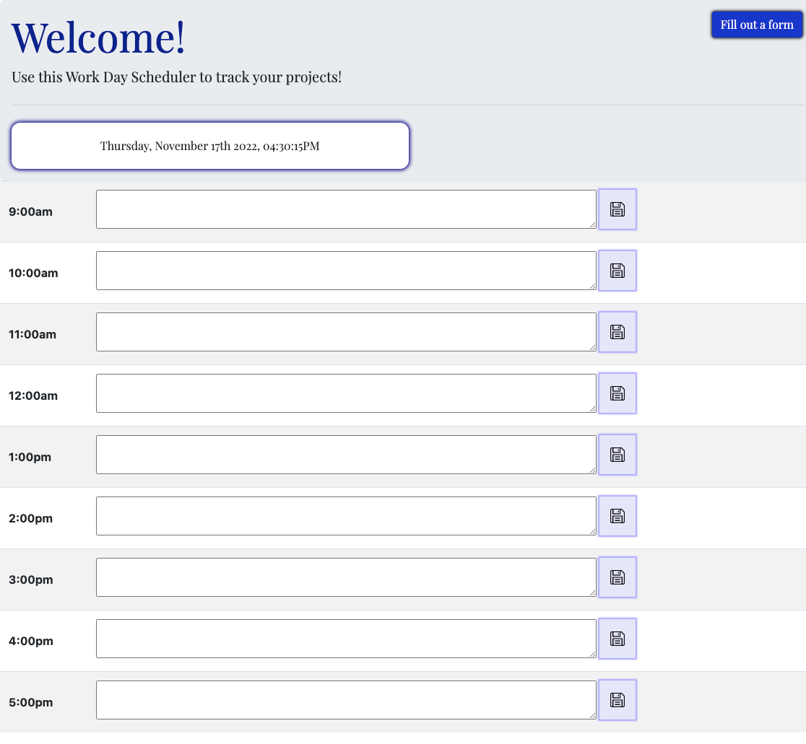

# Project-Tracker

# Description
- This is a webpage that allows you to track your projects. It is a work day scheduler where you can input information about your project such as the projec title, the type of project it is, the hourly wage, and the deadline.
- This project benefits users where they can keep an organized and timely schedule for their day. Users can input information into the scheduler by the hour and allows them to save the information in the local server.

# Screenshots

# Deployed Application
Check out my deployed application [here](https://amandagl1.github.io/Project-Tracker/)!
